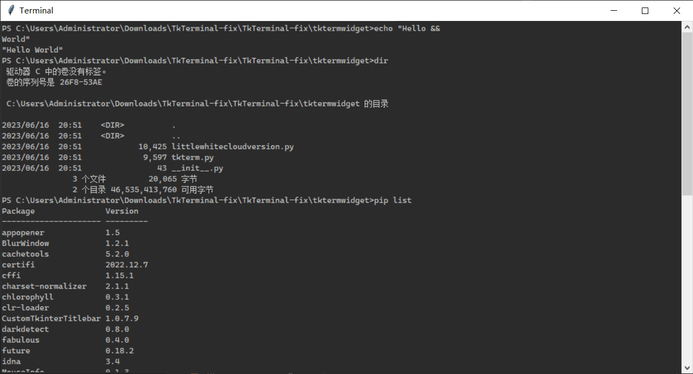

<h1 align="center"> TkTerminal </h1>

[](https://pypi.org/project/tktermwidget)


### 🌏 [简体中文](README_CH.md)

```TkTerminal``` is a terminal emulator written in Python using tkinter. It is quite easy to use.
### Windows


### MacOS


## Features
- User can set the terminal widget with their own options
- Use \ to make new lines (On Windows it is &&)
- Command history recorder
- Styles
- And some on

## Future ideas
- Highlight

## Styles
```tkterminalwidget``` also have some styles to use such as ```Powershell``` ```Command```:


## Installation:
```batch
pip install tktermwidget
```

## Example:
```python
from tkinter import Tk

from tkterm import Terminal

# Create root window
root = Tk()

# Hide root window during initialization
root.withdraw()

# Set title
root.title("Terminal")

# Create terminal
term = Terminal(root)
term.pack(expand=True, fill="both")

# Set minimum size and center app

# Update widgets so minimum size is accurate
root.update_idletasks()

# Get minimum size
minimum_width: int = root.winfo_reqwidth()
minimum_height: int = root.winfo_reqheight()

# Get center of screen based on minimum size
x_coords = int(root.winfo_screenwidth() / 2 - minimum_width / 2)
y_coords = int(root.wm_maxsize()[1] / 2 - minimum_height / 2)

# Place app and make the minimum size the actual minimum size (non-infringable)
root.geometry(f"{minimum_width}x{minimum_height}+{x_coords}+{y_coords}")
root.wm_minsize(minimum_width, minimum_height)

# Show root window
root.deiconify()

# Start mainloop
root.mainloop()
```

