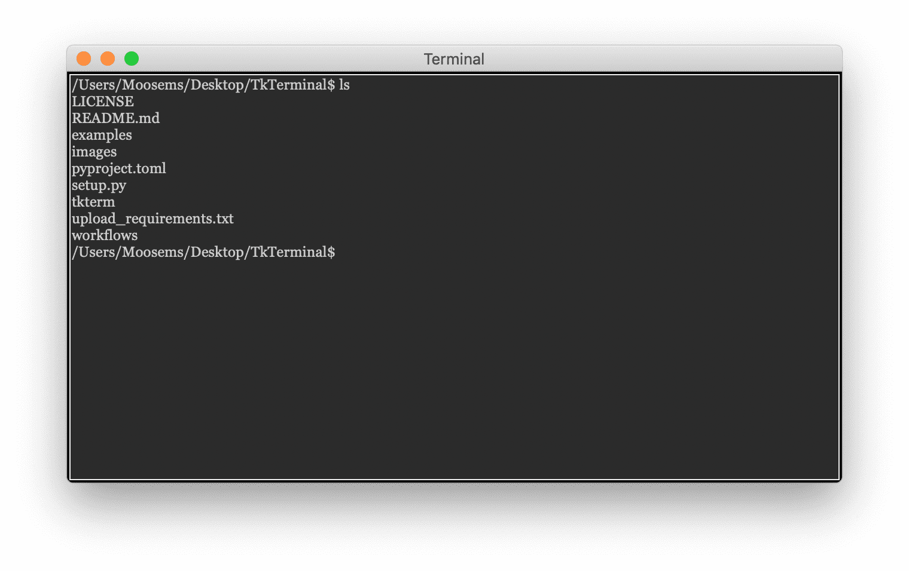

<h1 align="center"> TkTerminal </h1>

```TkTermianl``` 是一个使用 tkinter 用 Python 编写的终端模拟器

### Windows


### MacOS


## 特征
- 用户可以使用他们自己的观点来设置终端控件，就像文本控件一样
- 用 \ 来输入新行 (Windows上是&&)
- 命令历史记录
- 等等

## 未来想法
- 语法高亮

## 安装:
```batch
pip install tktermwidget
```

## 样例:
```python
# -*- coding: gbk -*-
from tkinter import Tk

from tkterm import Terminal

# 创建窗口
root = Tk()

# 隐藏窗口
root.withdraw()

# 设置标题
root.title("Terminal")

# 创建终端
term = Terminal(root)
term.pack(expand=True, fill="both")

# 设置窗口大小以及位置

# 更新，使部件准确无误
root.update_idletasks()

# 获取窗口最小值
minimum_width: int = root.winfo_reqwidth()
minimum_height: int = root.winfo_reqheight()

# 获取屏幕中间值
x_coords = int(root.winfo_screenwidth() / 2 - minimum_width / 2)
y_coords = int(root.wm_maxsize()[1] / 2 - minimum_height / 2)

# 放置应用程序并将最小大小设置为实际最小大小
root.geometry(f"{minimum_width}x{minimum_height}+{x_coords}+{y_coords}")
root.wm_minsize(minimum_width, minimum_height)

# 显示窗口
root.deiconify()

# 开始循环
root.mainloop()
```


